## Keraunos: An Automated Deterministic AI Agent System
### Engineered by Gregory Kennedy ML/AI Engineer | March 2026


---

### Keraunos: A Deterministic AI Agent System

**Keraunos: The Thunderbolt of Zeus, forged by the Cyclopes in the heart of Mount Etna.**

A tool of absolute precision. It struck exactly where Zeus aimed, every time, without exception.

That is the design philosophy of Keraunos.

In a world flooded with AI tools that generate questionable "hope for the best" non-deterministic output, Keraunos is the thunderbolt that strikes with deterministic certainty. 

**Keraunos is a system built on the principle** that **the machine must prove its work before a human ever sees it.**

Ten deterministic stages. Sixty-four custom MCP tools. Every output passes automated linting, security scanning, and test execution enforced by quality gates that the AI cannot bypass, skip, or reorder. If Keraunos fails to fix an issue after two attempts, it does what no other AI tool does: it stops and asks a human for help.

**The Keraunos pipeline can verify its own remediations. Fix a problem, re-scan, confirm it is resolved — all in one automated flow. No other available tool closes the loop deterministically.**

The ancient Greeks understood that true power is not brute force, it is force applied with divine precision. The Cyclopes forged a bolt that never missed.

Keraunos does not generate code or documents and hope they work.  
Keraunos generates code and documents and *proves* it works.

Self-hosted. Air-gappable. Built on custom fine-tuned open-source models for your specific use cases.

---

## Table of Contents

1. [Keraunos for Law Firms: Complete Use Case](#keraunos-for-law-firms-complete-use-case)
   - [The Synthesis: Law Firm Use Case](#the-synthesis-law-firm-use-case-small-medium-and-large-law-firms)
   - [The Problem: Why Law Firms Need This](#1-the-problem-why-law-firms-need-this)
   - [The Keraunos Legal Pipeline: 10 Stages](#2-the-keraunos-legal-pipeline-10-stages)
   - [Legal-Specific MCP Tools](#3-legal-specific-mcp-tools-the-legal-toolshed)
   - [Custom Fine-Tuned Legal Model](#4-custom-fine-tuned-legal-model-the-distillation-system)
   - [Data Sovereignty and Ethical Compliance](#5-data-sovereignty-and-ethical-compliance)
   - [Financial Impact](#6-financial-impact)
   - [Implementation Roadmap](#7-implementation-roadmap)
   - [Competitive Differentiation](#8-competitive-differentiation)
   - [Risk Mitigation](#9-risk-mitigation)
   - [Summary for Law Firm Partners](#10-summary-for-law-firm-partners)
2. [Introduction](#keraunos-a-deterministic-ai-agent-system)
3. [Executive Summary](#1-executive-summary)
4. [Architecture Deep Dive](#2-keraunos-architecture-deep-dive)
   - [Blueprint Pattern: Deterministic + Non-Deterministic](#21-the-blueprint-pattern-deterministic--non-deterministic)
   - [Context Engineering Over Prompt Engineering](#22-context-engineering-over-prompt-engineering)
   - [The Three-Tier Feedback Loop](#23-the-three-tier-feedback-loop)
   - [Security Through Isolation](#24-security-through-isolation)
   - [AGENTS.md vs Skills](#25-agentsmd-vs-skills)
   - [Agent Runtime: Block Goose](#26-agent-runtime-block-goose-v1261)
5. [Core Architecture: The Blueprint Pipeline](#3-core-architecture-the-blueprint-pipeline)
6. [Language-Specific Standards](#4-language-specific-standards)
7. [Security Architecture](#5-security-architecture)
   - [Defense in Depth](#51-defense-in-depth)
   - [Security Mandates (Non-Negotiable)](#52-security-mandates-non-negotiable)
   - [Dependency Verification Protocol](#53-dependency-verification-protocol-mandatory)
8. [MCP Tool Integration](#6-mcp-tool-integration-toolshed-pattern)
9. [Skills System](#7-skills-system)
   - [Skills Discovery](#71-skills-discovery)
   - [Skill Eval Framework](#72-skill-eval-framework)
10. [Use Cases](#use-cases)
11. [Features](#features)
    - [Programmatic Tool Calling (PTC)](#1-programmatic-tool-calling-ptc)
    - [MCP Toolshed: 64-Tool Specification](#2-mcp-toolshed-64-tool-specification)
    - [System Architecture: Tools](#system-architecture-tools)
12. [Custom Fine-Tuning Distillation System](#10-custom-fine-tuning-distillation-system)
    - [Strategic Foundation, Product Policy, and Data Pipeline](#section-1-strategic-foundation-product-policy-and-data-pipeline)
    - [Multi-Tier Distillation and Student Model Optimization](#section-2-multi-tier-distillation-and-student-model-optimization)
    - [Human Element Scaling Strategy (HESS)](#section-3-human-element-scaling-strategy-hess)
    - [Final Cookbook Checklist](#final-cookbook-checklist)
    - [Conclusion](#conclusion-1)
13. [Getting Started](#8-getting-started)
14. [Key Principles](#12-key-principles)

---

## 1. Executive Summary

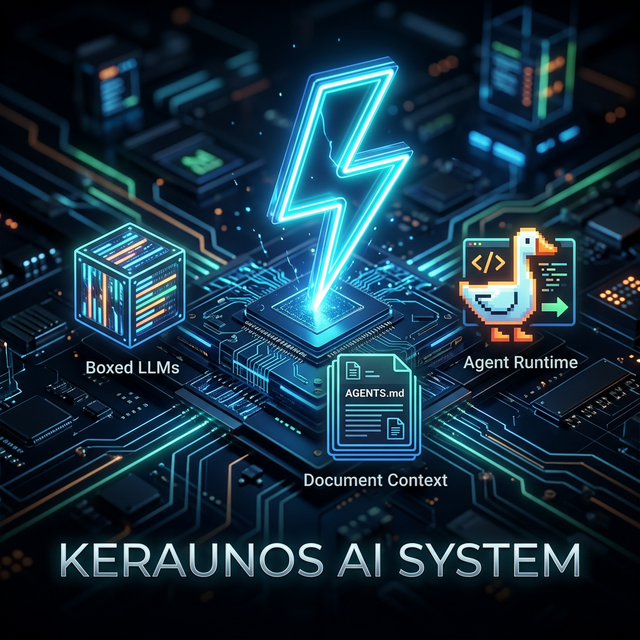

This overview synthesizes three cutting-edge approaches into a unified, implementable system:

**Stripe's Minions Blueprint Pattern** — Deterministic orchestration nodes interleaved with bounded non-deterministic LLM reasoning. The core insight: "putting LLMs into contained boxes compounds into system-wide reliability upside." Over 1,000 merged PRs/week at Stripe using this exact pattern.

**AGENTS.md Passive Context** — Vercel's research proves that embedding compressed documentation directly into AGENTS.md achieves 100% pass rates in agent evals, compared to 53% baseline and 79% for actively-triggered skills. Passive context eliminates the decision point where agents fail to invoke available tools.

**Agent Skills Standard** — The open standard (originally by Anthropic, now adopted by GitHub Copilot, OpenAI Codex, Cursor, OpenHands, and others) for packaging procedural knowledge as SKILL.md files with progressive disclosure: metadata loaded at startup, full instructions loaded on activation, scripts/resources loaded on demand.

**Block Goose Agent Runtime (v1.26.1)** — The open-source (Apache-2.0) AI agent from Block that Stripe forked for their Minions system. Written in Rust with native MCP integration (rmcp 0.15.0+), multi-model support, Goose Recipes (YAML workflow definitions), Custom Distributions, and Agent Client Protocol (ACP) for IDE integration. 31K+ stars, 400+ contributors. Our system builds on Goose's agent loop, extending it with Blueprint orchestration and domain-specific skills.

---
### Keraunos for Law Firms: Use Case
## The Synthesis: Law Firm Use Case


## The Synthesis: Law Firm Use Case 

A partner types in a "Legal Document Agent" USE CASE — for example, "Draft an NDA for a SaaS vendor handling PHI data, governed by California law, with a 2-year term and mutual non-disclosure obligations." The system — powered by a Goose-based agent runtime — uses the Blueprint Pipeline (Stripe pattern) where deterministic nodes handle jurisdiction detection, regulatory clause extraction, template compliance validation, citation verification, conflict-of-interest scanning, and privilege-safe audit logging, while non-deterministic nodes (bounded LLM calls) handle clause drafting, risk analysis narrative, and plain-language summary generation. 

Context is served via a centralized MCP Toolshed pre-hydrated with the firm's clause library, matter management data, jurisdictional requirements, and regulatory databases. The system is guided by an AGENTS.md file (passive context encoding the firm's style guide, citation format, and ethical rules), conditional rule files (.goosehints for practice-area-specific constraints), and modular Skills (activated on demand for specialized tasks like HIPAA mapping or SEC filing review). 

Output: a complete, jurisdiction-verified, citation-checked legal document with a compliance certification, a redline showing all AI-generated content, and a risk assessment — all produced under a deterministic audit trail that satisfies bar association requirements for AI-assisted legal work. The firm's custom fine-tuned model (distilled from a 14B Teacher to a 3B Student using the firm's own approved precedent library) ensures terminology, tone, and formatting match the firm's existing work product exactly. Self-hosted on the firm's own infrastructure — no client data ever leaves the firm's network.

---

## 1. The Problem: Why Law Firms Need Keraunos

### 1.1 The Document Volume Crisis

A mid-size law firm (50-200 attorneys) produces 10,000-50,000 documents annually: contracts, NDAs, corporate governance documents, regulatory filings, litigation briefs, opinion letters, due diligence reports, and client memoranda. The economics are brutal:

- **Junior associate time:** $250-450/hour spent on first drafts that partners rewrite
- **Average NDA:** 3-5 billable hours to draft, review, and finalize ($750-$2,250)
- **Complex contract:** 20-40 billable hours ($5,000-$18,000)
- **Due diligence report:** 80-200 billable hours ($20,000-$90,000)
- **Regulatory filing:** 40-100 billable hours ($10,000-$45,000)

A significant portion of this work is structurally repetitive. The same clauses appear across thousands of documents with jurisdiction-specific variations. The legal reasoning is specialized, but the assembly is mechanical.

### 1.2 Why Current AI Tools Fail Law Firms

Every major AI vendor is pitching "AI for legal." They all fail on the same points:

**No Compliance Verification.** ChatGPT, Copilot, and Harvey generate plausible legal text. But "plausible" is not "correct." No existing tool deterministically verifies that a generated contract includes all jurisdiction-required clauses, that citations reference actual case law, or that regulatory references are current. A partner must still read every word — eliminating the productivity gain.

**No Audit Trail.** Bar associations increasingly require disclosure of AI assistance in legal work. Current tools provide no immutable record of what the AI generated versus what a human wrote. This creates ethical exposure.

**No Data Sovereignty.** Law firms have ethical obligations to protect client confidentiality (ABA Model Rule 1.6). Sending client data to OpenAI, Google, or Microsoft cloud endpoints — even with enterprise agreements — creates risk that many firms are unwilling to accept. Privilege waiver arguments are untested.

**No Firm-Specific Knowledge.** Every firm has its own clause libraries, formatting standards, citation preferences, and institutional knowledge. Generic AI models produce generic output that requires extensive rework to match firm standards.

### 1.3 What Keraunos Solves

Keraunos addresses every failure point:

| Problem | Keraunos Solution |
|---------|------------------|
| No compliance verification | Deterministic nodes verify jurisdiction requirements, citation accuracy, and regulatory completeness — the AI cannot bypass these checks |
| No audit trail | Every pipeline run produces an immutable, timestamped log of every node execution, every AI decision, and every human review — stored in PostgreSQL |
| No data sovereignty | Fully self-hosted on the firm's own infrastructure. Client data never leaves the firm's network. Air-gappable. No external API calls required. |
| No firm-specific knowledge | Custom fine-tuned models distilled from the firm's own precedent library using the Keraunos Distillation System (14B Teacher to 3B Student) |
| No quality guarantee | 10-stage pipeline with deterministic quality gates. Max 2 AI fix attempts before human escalation. |

---

## 2. The Keraunos Legal Pipeline: 10 Stages


When a legal professional triggers Keraunos (typing `/legal Draft an NDA for...`), the following 10-stage pipeline executes:

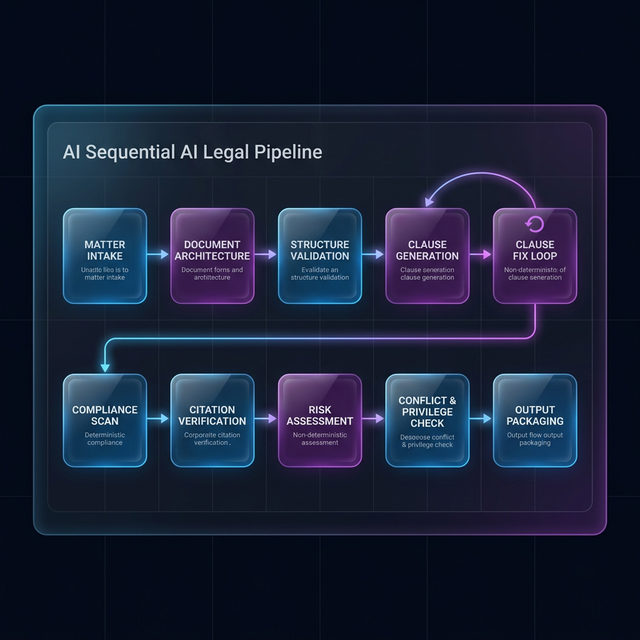

■ = Deterministic (fixed code, AI cannot bypass)
◆ = Non-Deterministic (bounded LLM, max 2 fix rounds)


### Stage Details

**Stage 1: Matter Intake & Classification (Deterministic)**
MCP tools parse the request and extract: document type (NDA, MSA, SPA, brief, memo), jurisdiction (state, federal, international), practice area (corporate, IP, employment, litigation, regulatory), parties and roles, key commercial terms, and governing law. This is pure pattern matching and entity extraction — no LLM creativity needed.

**Stage 2: Document Architecture (Non-Deterministic, Bounded)**
The LLM — using the firm's custom fine-tuned model — designs the document structure: which sections to include, which clauses are required vs optional for this jurisdiction, which firm templates to reference. Output is structured JSON validated against the firm's document schema.

**Stage 3: Structure Validation (Deterministic)**
Deterministic check: Does the planned structure include all jurisdiction-required sections? California NDAs require specific trade secret definitions per Civil Code §3426.1. Delaware corporate documents require specific statutory references. HIPAA-adjacent agreements require BAA provisions. This check is a lookup table, not LLM reasoning — it cannot be wrong.

**Stage 4: Clause Generation (Non-Deterministic, Bounded)**
The LLM drafts each clause using: the firm's clause library (retrieved via MCP `search_clause_library` tool), jurisdiction-specific language from the regulatory database, and the custom fine-tuned model that has learned the firm's exact tone, formatting, and citation style through distillation.

**Stage 5: Clause Fix Loop (Non-Deterministic, Max 2 Rounds)**
If the compliance scan (Stage 6) or citation verification (Stage 7) finds issues, the LLM attempts to fix them. Maximum 2 attempts. After 2 failures, the document is marked `ESCALATED` and routed to a human attorney with specific notes on what failed and why. The AI never silently ships a non-compliant document.

**Stage 6: Compliance Scan (Deterministic)**
Automated checks against: jurisdiction-specific clause requirements, regulatory reference currency (are cited regulations still in effect?), internal consistency (do defined terms match across sections?), conflicting provisions, and missing boilerplate. This is the "legal linter" — it checks the document against rules the same way a code linter checks source against style rules.

**Stage 7: Citation Verification (Deterministic)**
Every case citation is checked: Does this case exist? Is it still good law (not overruled or superseded)? Is the citation format correct per the firm's style guide (Bluebook, ALWD, or firm-specific)? Every statute reference is validated against the current code. Every regulatory reference is checked for currency. This is deterministic database lookup — no LLM reasoning, no possibility of hallucination.

**Stage 8: Risk Assessment (Non-Deterministic, Bounded)**
The LLM generates a risk analysis: identifies terms unfavorable to the client, missing protections, liability exposure areas, and comparison to market standard terms. This is the one stage where LLM creativity adds genuine value — pattern recognition across thousands of similar agreements.

**Stage 9: Conflict & Privilege Check (Deterministic)**
Deterministic check against the firm's matter management database: Are any parties in this transaction adverse to existing clients? Does the generated document contain any information that could waive attorney-client privilege? Are all AI-generated sections clearly marked for the audit trail?

**Stage 10: Output Packaging (Deterministic)**
Produces:
- **The document** in the firm's standard format (DOCX with firm letterhead)
- **A redline** showing all AI-generated content vs template content
- **A risk assessment memo** with specific recommendations
- **A compliance certification** listing every check passed
- **An immutable audit trail** (timestamped log of every stage, every AI decision, every human review, stored in PostgreSQL)

---

## 3. Legal-Specific MCP Tools (The Legal Toolshed)

In addition to the 64 general-purpose tools, Keraunos for Law Firms adds 20 legal-specific MCP tools:

### Legal Document Tools (8)

| Tool | Purpose |
|------|---------|
| `search_clause_library` | Semantic search across the firm's clause library (pgvector) |
| `validate_jurisdiction` | Check document against jurisdiction-specific requirements |
| `verify_citation` | Validate case citations (existence, good law status, format) |
| `check_statute_currency` | Verify statute references are current and not amended |
| `detect_conflicting_clauses` | Find internally contradictory provisions |
| `extract_defined_terms` | Parse all defined terms and check consistency |
| `generate_redline` | Produce tracked-changes version showing AI vs template content |
| `format_document` | Apply firm's formatting standards (fonts, margins, numbering) |

### Compliance & Regulatory Tools (6)

| Tool | Purpose |
|------|---------|
| `map_regulatory_requirements` | Map document to applicable regulations (HIPAA, GDPR, SOX, etc.) |
| `check_regulatory_coverage` | Verify all required regulatory provisions are included |
| `scan_privilege_risk` | Detect content that could waive attorney-client privilege |
| `check_ethical_compliance` | Verify against ABA Model Rules and state bar requirements |
| `generate_ai_disclosure` | Create required disclosure of AI assistance per bar rules |
| `check_data_sovereignty` | Verify no client data references external services |

### Matter Management Tools (6)

| Tool | Purpose |
|------|---------|
| `check_conflicts` | Query matter DB for client/party conflicts |
| `log_ai_action` | Record AI decision to immutable audit trail |
| `retrieve_precedent` | Find similar past documents from firm's DMS |
| `calculate_billing_impact` | Estimate time saved vs manual drafting |
| `route_for_review` | Assign document to appropriate partner for human review |
| `generate_matter_memo` | Create matter file entry documenting AI-assisted work |

---

## 4. Custom Fine-Tuned Legal Model (The Distillation System)

This is where Keraunos becomes truly specific to a law firm. Using the Keraunos AI Custom Fine-Tuning Distillation System:

### Phase 1: Build the Golden Dataset from Firm Precedent

The firm provides its approved precedent library — the best examples of each document type as produced by the firm's partners over the years. These become the "Golden Dataset." Total exemplar count ranges from 1,000 for a boutique practice to 50,000+ for a multi-practice, multi-jurisdictional firm.

- **NDAs:** 200-5,000 approved exemplars across jurisdictions
- **MSAs/SOWs:** 150-3,000 approved exemplars
- **Corporate governance:** 100-2,000 approved exemplars
- **Regulatory filings:** 100-5,000 approved exemplars per filing type
- **Client memos:** 200-10,000 approved exemplars
- **Litigation documents:** 200-15,000 approved exemplars (briefs, motions, discovery)
- **Opinion letters:** 50-5,000 approved exemplars

### Phase 2: Author the Product Policy (Legal Style Guide)

A 20-page document encoding the firm's exact standards:

- **Citation format:** Bluebook 21st Ed with firm-specific modifications
- **Defined term conventions:** capitalization, placement, cross-reference style
- **Clause ordering:** the firm's preferred section sequence per document type
- **Tone and formality:** the specific register the firm uses with each client type
- **Boilerplate preferences:** which standard clauses the firm always includes
- **Redline conventions:** how tracked changes are formatted and presented

### Phase 3: Synthetic Data Generation

Using the Golden Dataset and Product Policy, a SOTA frontier model generates 10,000-500,000 synthetic training pairs (10x multiplier on the Golden Dataset):
- Input: "Draft a non-compete clause for a California employment agreement, 12-month term, limited to direct competitors"
- Output: The exact clause the firm would produce, in the firm's format, with the firm's preferred language

Human review gate: attorneys verify a sample before inclusion.

### Phase 4: Multi-Tier Distillation

| Model | Parameters | Purpose | Cost/Token |
|-------|-----------|---------|------------|
| Teacher | 14B-20B | Learn the firm's complete legal style and knowledge | High (training only) |
| Intermediate | 7B-10B | Bridge model for compression | Medium (training only) |
| Student | 3B-4B | Production inference model | Very low (~$0.001/1K tokens) |

The 3B Student model runs locally on the firm's own hardware via Ollama. Inference cost is effectively zero after training. The model produces output that is stylistically indistinguishable from the firm's own attorneys' work product.

### Phase 5: Continuous Learning

As partners review and modify AI output, those corrections feed back into the training pipeline. The model improves with every document the firm produces. After 6 months of production use, the model has learned from thousands of partner corrections — knowledge that would take a junior associate years to accumulate.

---

## 5. Data Sovereignty and Ethical Compliance

### Self-Hosted Architecture

The entire Keraunos system runs on the firm's own infrastructure:

- **VPS or on-premise server** (32GB+ RAM recommended)
- **Dokploy** manages containerized services
- **PostgreSQL + pgvector** stores all data on-premise
- **Ollama** runs the custom fine-tuned model locally
- **No external API calls** — the 3B Student model runs entirely on the firm's hardware
- **Air-gappable** — can operate with zero internet connectivity

**No client data ever leaves the firm's network.** Not to OpenAI. Not to Google. Not to Microsoft. Not to any cloud provider. The firm maintains complete custody of all data at all times.

### Bar Association Compliance

- **ABA Model Rule 1.6 (Confidentiality):** Satisfied by self-hosted architecture. No third-party data transmission.
- **ABA Model Rule 1.1 (Competence):** The deterministic quality gates ensure AI output meets professional standards before human review. The system is a tool that enhances competence, not a replacement for it.
- **ABA Model Rule 5.3 (Supervisory Responsibility):** The human review gate (Stage 10) ensures an attorney reviews every document. The audit trail documents the supervision chain.
- **AI Disclosure Requirements:** The `generate_ai_disclosure` MCP tool automatically creates required disclosures per the applicable state bar's AI rules.
- **Audit Trail:** Every AI action is logged immutably in PostgreSQL. The firm can produce a complete record of what the AI generated, what the attorney modified, and what was delivered to the client.

---

## 6. Financial Impact

### Per-Document Economics

| Document Type | Manual Cost | Keraunos Cost | Savings | Time Saved |
|---------------|------------|---------------|---------|------------|
| Standard NDA | $1,500 (5 hrs) | $50 (infra + review) | 97% | 4.5 hrs |
| Complex NDA (multi-jurisdiction) | $4,500 (15 hrs) | $200 (infra + review) | 96% | 13 hrs |
| Master Services Agreement | $9,000 (30 hrs) | $500 (infra + review) | 94% | 27 hrs |
| Employment Agreement | $3,000 (10 hrs) | $150 (infra + review) | 95% | 9 hrs |
| Due Diligence Report | $45,000 (150 hrs) | $3,000 (infra + review) | 93% | 135 hrs |
| Regulatory Filing | $22,500 (75 hrs) | $2,000 (infra + review) | 91% | 67 hrs |
| Client Memorandum | $1,500 (5 hrs) | $75 (infra + review) | 95% | 4.5 hrs |

### Firm-Level Annual Impact (50-Attorney Firm)

| Metric | Before Keraunos | After Keraunos | Impact |
|--------|----------------|----------------|--------|
| Documents produced/year | 10,000 | 10,000+ | Same or higher volume |
| Average draft time | 8 hours | 45 minutes | 90% reduction |
| Annual associate hours on drafting | 40,000 | 4,000 | 36,000 hours freed |
| Associate hours redirected to high-value work | 0 | 36,000 | Revenue uplift |
| Infrastructure cost | $0 | $8,400-$31,000/year (infra + maintenance) | Minimal vs capacity freed |
| Annual cost savings (at $300/hr avg) | — | $10.8M in freed capacity | — |
| Quality incidents (compliance gaps) | ~120/year (industry avg) | ~5/year (escalated + caught) | 96% reduction |

### ROI Calculation

- **Self-hosted VPS infrastructure:** $2,500-$25,000 (one-time setup, scaling with firm size)
- **Annual maintenance:** $2,400-$6,000/year (VPS monitoring, updates)
- **Model training (one-time):** $15,000-$75,000 (distillation pipeline, scaled to exemplar volume)
- **Ongoing training refinement:** $5,000-$15,000/year (incremental learning from attorney corrections)
- **Year 1 total cost:** ~$50,000-$121,000 (depending on firm size and exemplar volume)
- **Year 1 capacity freed:** $10.8M equivalent (50-attorney firm)
- **ROI:** 89:1 to 216:1 (depending on firm size and document volume)

---

## 7. Implementation Roadmap

### Month 1: Foundation
- Deploy Keraunos infrastructure on firm's hardware
- Index the firm's clause library into pgvector
- Configure matter management database connection
- Deploy the 15 starter MCP tools + 8 legal document tools

### Month 2: Distillation
- Collect Golden Dataset from firm's precedent library (1,000-50,000 exemplars depending on firm size, practice area breadth, and jurisdictional coverage)
- Author the Product Policy (legal style guide)
- Generate synthetic training data (1,000+ pairs)
- Train Teacher model (14B), distill to Student (3B)

### Month 3: Pilot
- Deploy to 3-5 attorneys across practice areas
- Start with low-risk document types (standard NDAs, client memos)
- Human reviews every document (100% review rate)
- Corrections feed back to model refinement

### Month 4-6: Expansion
- Expand to all attorneys
- Add complex document types (MSAs, regulatory filings)
- Reduce human review to targeted review (AI-flagged sections only)
- Deploy remaining legal-specific MCP tools

### Month 7-12: Optimization
- Continuous model refinement from partner corrections
- Add practice-area-specific Skills
- Integrate with firm's DMS (iManage, NetDocuments)
- Integrate with firm's billing system for automated time capture

---

## 8. Competitive Differentiation

| Feature | Harvey AI | CoCounsel | Keraunos |
|---------|----------|-----------|----------|
| Deterministic compliance verification | No | No | Yes (pipeline gates) |
| Citation verification | Partial | Yes (limited) | Yes (deterministic, every citation) |
| Custom firm-specific model | No (generic) | No (generic) | Yes (distilled from firm's precedent) |
| Self-hosted / air-gapped | No (cloud only) | No (cloud only) | Yes (fully self-hosted) |
| Client data sovereignty | Third-party cloud | Third-party cloud | Firm's own infrastructure |
| Immutable audit trail | Partial logs | Partial logs | Full pipeline audit trail (PostgreSQL) |
| Human escalation protocol | None | None | Automatic after 2 AI fix attempts |
| Bar association AI disclosure | Manual | Manual | Automated (MCP tool) |
| Cost per document | $50-500/mo subscription | $100-250/user/mo | ~$0.05 per document (inference) |
| Custom fine-tuning | Not available | Not available | Full distillation pipeline |

---

## 9. Risk Mitigation

### What If the AI Gets Something Wrong?

This is the question every firm asks. The answer is the pipeline architecture itself:

1. **The AI cannot skip quality gates.** The deterministic nodes (Stages 1, 3, 6, 7, 9) run as fixed code. They execute the same way every time. The AI has no ability to bypass, modify, or skip them.

2. **The AI gets exactly 2 fix attempts.** If a compliance scan or citation verification fails and the AI cannot fix it in 2 rounds, the system stops and escalates to a human. It does not silently continue.

3. **Every document requires human review.** Keraunos is a force multiplier, not a replacement. The pipeline produces a draft with a compliance certification and redline. An attorney still reviews and approves before delivery.

4. **The audit trail is immutable.** If a regulatory body or court asks "did you use AI to draft this?", the firm can produce a complete, timestamped record of exactly what the AI generated, what checks it passed, and what the attorney modified.

5. **The model is the firm's own.** The custom fine-tuned model was trained on the firm's own approved precedent. It produces output that matches the firm's standards by construction, not by coincidence.

---

## 10. Summary for Law Firm Partners

**What it is:** An AI system that drafts legal documents in your firm's exact style, verifies every clause against jurisdiction requirements, checks every citation against actual case law, and produces an audit trail that satisfies bar association requirements — all running on your own hardware with zero client data leaving your network.

**What it is not:** A chatbot. A search engine. A generic AI that produces plausible-sounding legal text and hopes it is correct.

**The deterministic guarantee:** Every document passes through 10 stages. Seven of those stages are deterministic — they execute the same way every time, and the AI cannot bypass them. The three creative stages (document architecture, clause drafting, risk assessment) are bounded by strict validation on both input and output.

**The business case:** A 50-attorney firm frees approximately 36,000 associate hours annually — capacity that can be redirected to high-value client work, business development, or reduced associate burnout. Year 1 total investment: $50K-$121K depending on firm size. Year 1 ROI: 89:1 to 216:1.

**The ethical case:** Self-hosted. Air-gappable. Full audit trail. Automated AI disclosure. The system was designed from the ground up to satisfy ABA Model Rules 1.1, 1.6, and 5.3.

**The competitive case:** No other legal AI product offers deterministic compliance verification, custom fine-tuned models from the firm's own precedent, and full data sovereignty. Harvey and CoCounsel are cloud-only, generic-model products with no quality gates. Keraunos is the only system where the AI must prove its work before a human sees it.

*Keraunos does not draft documents and hope they are correct. Keraunos drafts documents and proves they are correct.*

---

## 2. Keraunos Architecture Deep Dive

### 2.1 The Blueprint Pattern (Deterministic + Non-Deterministic)

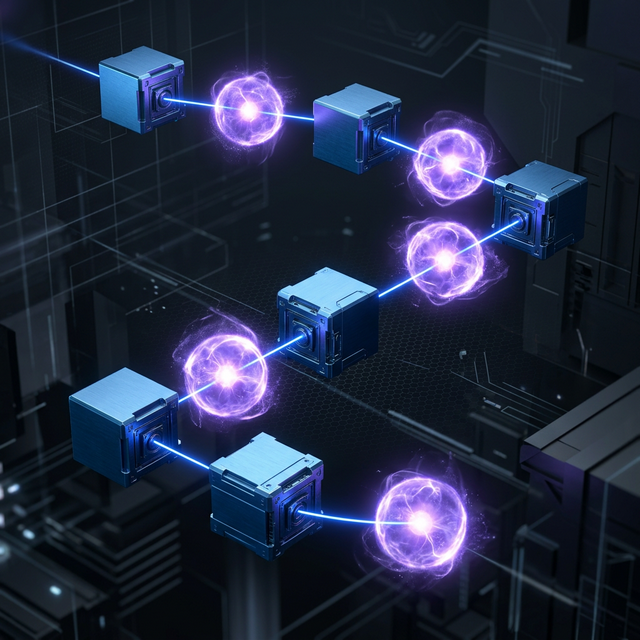

Stripe's breakthrough is the **blueprint** — a workflow that alternates between two types of nodes:

**Deterministic Nodes**
- Execute the same way every time
- Cannot be skipped or modified by the LLM
- Examples: git operations, linter execution, CI triggering, security scanning
- Purpose: enforce reliability, auditability, and safety

**Non-Deterministic Nodes (Agent Loops)**
- LLM reasons and makes creative decisions
- Bounded by structured output schemas
- Capped at maximum iterations (Stripe uses 2 CI rounds)
- Purpose: handle tasks requiring judgment — code writing, error diagnosis

The key architectural principle: the **system** runs the **model**, not the reverse. The LLM is a powerful component inside a deterministic harness, not an autonomous agent with free rein.

### 2.2 Context Engineering Over Prompt Engineering

Stripe's second major insight is that the quality of **context assembly** matters more than the sophistication of the agent loop. Before the LLM activates, a deterministic prefetch layer:

1. Scans the input for links, tickets, and keywords
2. Queries internal documentation via MCP (Model Context Protocol)
3. Searches the codebase via Sourcegraph
4. Curates a surgical subset of ~15 relevant tools (out of 400+ available in Stripes Case)
5. Packages this context into the LLM's prompt

This front-loading of intelligence into the prompt is what makes one-shot execution work. Each minion receives a fully assembled context payload, executes once, and returns structured output.

### 2.3 The Three-Tier Feedback Loop

1. **Local Lint (< 5 seconds)**: Fast feedback for formatting and style issues
2. **Selective CI**: Only relevant tests run, with autofixes applied where possible
3. **Pragmatic Cap**: Maximum 2 fix attempts. If the LLM can't fix it in 2 tries, a third won't help — escalate to a human

### 2.4 Security Through Isolation

Every minion runs in an isolated devbox (pre-warmed VM):
- No internet access
- No production access
- Identical to human engineer environments
- Spins up in ~10 seconds
- Complete sandboxing enables infinite parallelization without permission checks

### 2.5 AGENTS.md vs Skills

#### Vercel's Eval Results (January 2026)

Vercel ran hardened evals targeting Next.js 16 APIs not in model training data:

| Configuration         | Pass Rate | vs Baseline|
|----------------------|-----------|-------------|
| Baseline (no docs)   | 53%       | —           |
| Skill (default)      | 53%       | +0pp        |
| Skill + instructions | 79%       | +26pp       |
| **AGENTS.md**        | **100%**  | **+47pp**   |

**Why passive context wins:**
1. No decision point — the agent never has to decide "should I look this up?"
2. Consistent availability — present in every turn, not loaded asynchronously
3. No ordering issues — no sequencing decisions about when to read docs

**The compression technique:** 40KB of docs compressed to 8KB using a pipe-delimited index format that tells the agent where to find specific doc files. The agent reads files on demand but always knows what's available.

#### When Skills Still Win

Skills outperform AGENTS.md for **vertical, action-specific workflows** that users explicitly trigger: "upgrade my framework version," "run a security audit," "generate a PR review." The two approaches are complementary, not competing.

#### The Agent Skills Specification

The open standard defines a minimal, portable format:

```
skill-name/
├── SKILL.md           # Required: YAML frontmatter + markdown instructions
├── scripts/           # Optional: executable code (Python, Bash, JS)
├── references/        # Optional: additional documentation
└── assets/            # Optional: templates, resources
```

Progressive disclosure manages context efficiently:
- **Discovery**: Only name + description loaded at startup (~50 tokens per skill)
- **Activation**: Full SKILL.md loaded when task matches (~2,000-5,000 tokens)
- **Execution**: Scripts and references loaded only when needed

#### The Hybrid Strategy (Our Synthesis)

We combine AGENTS.md and Skills in a complementary way:

**AGENTS.md handles:**
- Language standards and versions (changes slowly, needs passive availability)
- Security mandates (non-negotiable, must be in every prompt)
- Blueprint pipeline definition (structural, always relevant)
- Compressed dependency/docs index (retrieval-led reasoning)
- MCP tool configuration

**Skills handle:**
- Use case parsing workflow (activated on input)
- Code generation patterns (activated per component)
- Security audit procedures (activated after code gen)
- Test generation (activated per component)
- Skill/AGENTS.md generation for output projects

This hybrid captures the 100% reliability of passive context for critical standards while using progressive disclosure for task-specific workflows that would bloat the context.

### 2.6 Agent Runtime: Block Goose (v1.26.1)

The agent loop is built on [Block's Goose](https://github.com/block/goose) (Apache-2.0), the same open-source agent runtime that Stripe forked for their Minions system. Goose provides the foundational agent execution layer:

- **Rust core** with CLI and Electron desktop interfaces
- **Native MCP integration** (rmcp 0.16.0) — first open-source agent to support MCP
- **Multi-model configuration** — works with any LLM, optimizes cost vs capability
- **Recipes** — YAML workflow definitions (goals, extensions, inputs, sub-recipes)
- **Custom Distributions** — preconfigured providers, extensions, and branding
- **Agent Client Protocol (ACP)** — integrates with VS Code, Cursor, Windsurf, JetBrains+++
- **Extension system** with malware validation and allowlisting

Our system extends Goose with Blueprint orchestration (deterministic + agent nodes), domain-specific skills, and the Toolshed MCP pattern described below.

---

## 3. Core Architecture: The Blueprint Pipeline

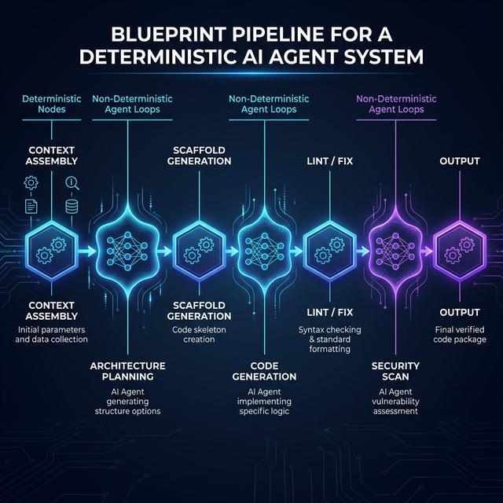

The system uses **Blueprints** — orchestration flows that alternate between fixed deterministic code nodes and open-ended agent loops. The principle: "putting LLMs into contained boxes compounds into system-wide reliability upside."

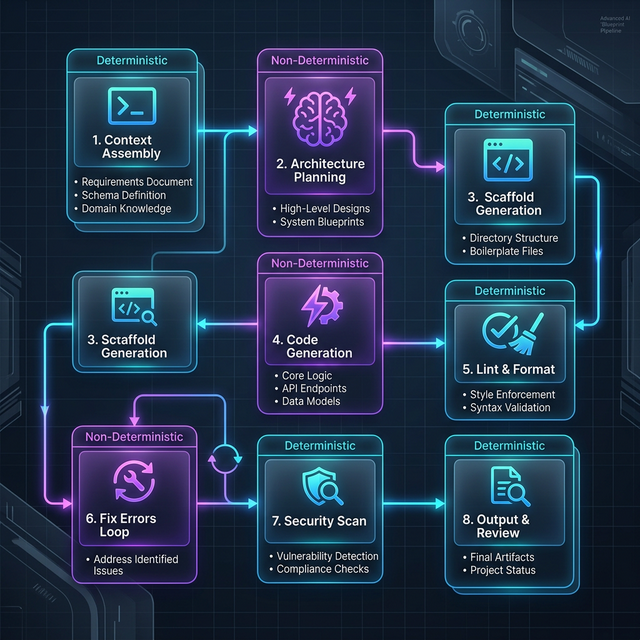


### Deterministic vs Non-Deterministic Rules

#### Deterministic Nodes

These steps execute as hardcoded pipeline stages. The LLM cannot bypass them.

1. **Context Assembly**: Parse input, fetch docs, curate tool subset
2. **Project Scaffolding**: Directory structure, dependency manifests, CI config
3. **Lint & Format**: Language-specific formatters run on every output
4. **Security Audit**: Dependency audit + SAST on every output
5. **Test Execution**: All tests must pass before output is staged
6. **Git Operations**: Commit, branch, PR creation are fixed code
7. **CI Cap Enforcement**: Maximum 2 fix-lint-test cycles, then escalate to human

#### Non-Deterministic Nodes (LLM Reasoning — Contained)

These steps use LLM judgment but are bounded by structured output schemas.

1. **Architecture Planning**: Must output valid JSON matching PlanSchema
2. **Code Generation**: Must follow active skill instructions and language specs
3. **Error Fixing**: Receives lint/test errors, applies fixes, max 2 rounds
4. **AGENTS.md Generation**: Produces project-specific agent instructions
5. **Skills Generation**: Produces SKILL.md files for discovered patterns

### Context Pre-Hydration (Stripe Minions Pattern)

Before the agent loop begins, the blueprint deterministically runs MCP tools over any links, references, or file paths in the input. This gives the agent rich context upfront rather than relying on it to discover information during execution.

### Rule Files (Conditional, Goose-Compatible)

Agent rules are stored as `.goosehints` files, conditionally applied based on subdirectory path. This enables targeted coding guidance per module without overwhelming the context window. The agent loads only rules relevant to the files being modified.

### Feedback Left-Shift

Catch issues before CI, following Stripe's 2-round-max principle:

1. **Pre-push hooks**: Local lint + format in <5 seconds via background daemon
2. **Local test subset**: Run directly-affected tests before pushing
3. **CI cap**: Maximum 2 CI rounds per agent run (cost vs diminishing returns)
4. **Auto-fixes**: If CI failure has a known autofix, apply without re-entering agent loop

### Goose Recipes for Reusable Workflows

Complex or recurring tasks are defined as Goose Recipes (YAML):
- Package goals, required extensions, structured inputs, and sub-recipes
- Enable engineers to parallelize multiple agent runs via Slack/CLI/Web
- Shareable across teams for consistent automated workflows

---

## 4. Language-Specific Standards

### Rust
- **Edition**: 2024
- **MSRV**: 1.94.0+ (required for LLD default linker, 7x linking speedup)
- **Formatter**: rustfmt (nightly for imports_granularity)
- **Linter**: clippy with `-D warnings -W clippy::pedantic`
- **Security**: `cargo audit` + `cargo deny check`
- **Dependencies**: Pin exact versions in Cargo.toml
- **Async Runtime**: tokio 1.49+ (default) or async-std with justification
- **Error Handling**: thiserror 2.x for libraries, anyhow for applications
- **Serialization**: serde + serde_json (1.x)
- **HTTP**: reqwest 0.12+ or axum 0.8+ for servers
- **Testing**: Built-in `#[cfg(test)]` + proptest for property-based
- **NEVER use unwrap() or expect()** — use proper error handling

### Python
- **Version**: 3.13+ (3.14 preferred, latest stable)
- **Formatter**: ruff format (replaces black)
- **Linter**: ruff check with `select = ["E", "W", "F", "I", "S", "B", "C4", "UP"]`
- **Type Checker**: mypy --strict or pyright
- **Security**: pip-audit + bandit + semgrep
- **Package Manager**: uv (preferred) or pip with --break-system-packages
- **Async**: asyncio with anyio for portability
- **HTTP**: httpx 0.28+ (client), FastAPI 0.115+ (server)
- **Testing**: pytest 8.x + hypothesis for property-based
- **Dependencies**: Pin in pyproject.toml with `[project.dependencies]`

### TypeScript/JavaScript
- **Runtime**: Node.js 24 LTS (or Deno 2.x / Bun 1.x with justification)
- **TypeScript**: 5.9+ with strict mode enabled (6.0 beta available)
- **Formatter**: prettier 3.x
- **Linter**: eslint 10.x flat config + @typescript-eslint
- **Security**: npm audit + eslint-plugin-security + semgrep
- **Package Manager**: npm 11+ or pnpm 10+
- **HTTP**: undici (client, built-in), Hono 4.x or Express 5.x (server)
- **Testing**: vitest 4.x (preferred) or jest 30.x
- **Build**: tsdown (Rolldown-powered, successor to tsup) for libraries, vite for applications
- **Dependencies**: Pin exact versions, use package-lock.json

---

## 5. Security Architecture


### 5.1 Defense in Depth

Following Stripe's model, security is baked into the deterministic pipeline:

| Layer | Type | What It Does |
|-------|------|-------------|
| 1. Input Validation | Deterministic | Sanitize and validate use case input |
| 2. Dependency Audit | Deterministic | Check all deps against CVE databases |
| 3. SAST Scanning | Deterministic | Static analysis per language |
| 4. Threat Modeling | Non-Deterministic (bounded) | LLM identifies attack surfaces |
| 5. Secret Scanning | Deterministic | Trufflehog patterns in generated code |
| 6. Test Execution | Deterministic | All tests must pass |
| 7. Human Review | Deterministic | Mandatory review gate |

### 5.2 Security Mandates (Non-Negotiable)

1. **No secrets in code**: Use environment variables or secret managers
2. **Input validation**: Validate and sanitize ALL external input at boundaries
3. **Dependency audit**: Run on every build; fail on known vulnerabilities
4. **SAST scanning**: semgrep or language-native (clippy/bandit/eslint-security)
5. **Least privilege**: Default deny; grant minimal required permissions
6. **Output encoding**: Context-appropriate encoding for all rendered output
7. **Cryptography**: Use well-known libraries only (ring/rustcrypto, cryptography.py, Node crypto)
8. **Authentication**: Never roll custom auth; use established libraries
9. **Logging**: Never log secrets, tokens, PII, or full request bodies
10. **Error messages**: Never expose internal details to end users

### 5.3 Dependency Verification Protocol (Mandatory)

Before recommending or pinning ANY dependency version, the LLM agent MUST:

1. **Web-search verify**: Use web search tool to confirm the latest stable release from the official package registry (crates.io, pypi.org, npmjs.com) on today's date
2. **Check maintenance status**: If a package is deprecated, archived, or unmaintained, identify and use the actively-maintained successor
3. **Verify MSRV/runtime compatibility**: Ensure minimum runtime versions capture critical improvements (e.g., Rust 1.92+ for LLD linker, Node 24 LTS for latest security patches)
4. **Document breaking changes**: Note any migration requirements for major version bumps
5. **Never rely on training data**: Cached knowledge of versions is unreliable — always verify against live registry data

### 5.4 Dependency Pinning Policy

All generated projects use **exact version pins**, not ranges:
- Rust: `serde = "1.0.217"` not `serde = "1"` 
- Python: `fastapi==0.115.6` not `fastapi>=0.100`
- TypeScript: `"zod": "3.24.1"` not `"zod": "^3.0.0"`

Version ranges introduce supply-chain risk. Exact pins are verified against registries at generation time.

---

## 6. MCP Tool Integration (Toolshed Pattern)

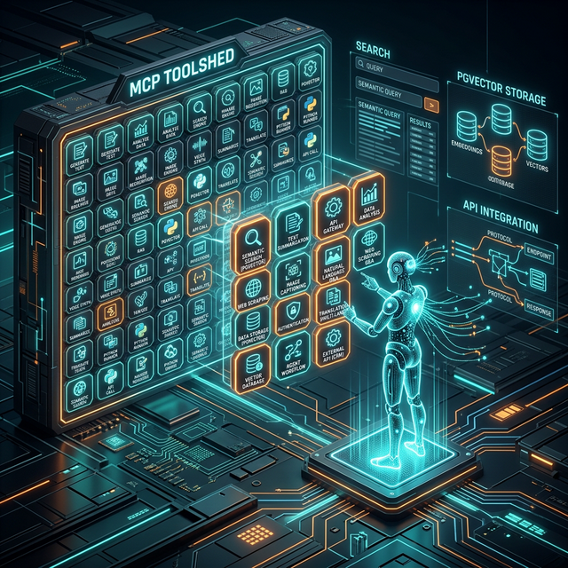

Agents access context through a centralized MCP server (modeled after Stripe's "Toolshed" — ~500 tools shared across all AI systems via MCP protocol):

- **Documentation Server**: Fetches language/framework docs on demand
- **Codebase Search**: Sourcegraph-style code search across the monorepo
- **Ticket/Spec Server**: Pulls use-case specs and acceptance criteria
- **Security DB Server**: Queries CVE databases and security advisories
- **Template Server**: Provides project scaffolding templates

Tool subsets are curated per task type. An agent NEVER receives all tools at once. The deterministic prefetch layer selects ~15 relevant tools based on the use case.

### Context Pre-Hydration (Stripe Minions Pattern)

Before the agent loop begins, the blueprint deterministically runs MCP tools over any links, references, or file paths in the input. This gives the agent rich context upfront rather than relying on it to discover information during execution.

---

## 7. Skills System


Skills are stored in `.agents/skills/` and follow the AgentSkills open standard. The agent discovers skills through progressive disclosure:

1. **Discovery**: Load name + description from each SKILL.md frontmatter
2. **Activation**: When use case matches a skill description, load full SKILL.md
3. **Execution**: Follow skill instructions, run skill scripts as needed
4. **Evaluation**: Run evals to verify the skill works correctly after changes
5. **Benchmarking**: Track pass rate, elapsed time, and token usage over time

### Skill Categories

Skills fall into two categories, which determine how they are tested and maintained:

| Category | Purpose | Eval Focus | Deprecation Signal |
|---|---|---|---|
| **Capability Uplift** | Encodes techniques the base model can't do consistently | Output quality, correctness | Base model passes ≥90% of evals without skill |
| **Encoded Preference** | Sequences steps the model can do individually, per team process | Process fidelity, tool ordering | Team process changes (update skill, not deprecate) |

Each SKILL.md frontmatter declares `skill_type: capability-uplift` or `skill_type: encoded-preference`.

### Description Tuning for Trigger Precision

As skill count grows, description precision becomes critical:
- **Too broad** → false triggers (skill activates when it shouldn't)
- **Too narrow** → missed activations (skill never fires when it should)

Each SKILL.md description includes **positive triggers** (when to activate) and **negative triggers** (when NOT to activate) to reduce both false positives and false negatives.

### Available Skill Categories

- `code-generation/` — Language-specific code generation patterns *(capability-uplift)*
- `security-audit/` — Security scanning and remediation workflows *(encoded-preference)*
- `use-case-processor/` — Use case parsing and architecture planning *(capability-uplift)*
- `project-scaffold/` — Template-based project initialization
- `test-generation/` — Test creation from specs and code
- `agents-md-generator/` — Generates project-specific AGENTS.md files
- `skills-generator/` — Creates new skills from completed workflows

### 7.2 Skill Eval Framework

Evals are tests that verify skills produce expected outputs for given prompts. Inspired by software testing: define test prompts, describe what good looks like, and run them to confirm the skill holds up.

#### Eval Lifecycle

```
┌─────────────┐    ┌──────────────┐    ┌──────────────┐    ┌───────────────┐
│ Define Evals│───▶│ Run Benchmark│───▶│ A/B Compare  │───▶│ Deploy / Tune │
│ (per skill) │    │ (pass/time/  │    │ (skill vs    │    │ (or deprecate)│
│             │    │  tokens)     │    │  no-skill)   │    │               │
└─────────────┘    └──────────────┘    └──────────────┘    └───────────────┘
       ▲                                                          │
       └──────────────────── iterate ─────────────────────────────┘
```

#### Running Evals

Each SKILL.md defines eval scenarios with:
- **Test prompt**: The input to the skill
- **Expected output criteria**: What correct output looks like
- **Pass/fail determination**: Based on criteria matching

#### Multi-Agent Parallel Execution

Evals run in **independent agent contexts** — each eval spins up a clean agent with no accumulated context from other evals. This prevents cross-contamination and provides per-eval token/timing metrics. Run evals in parallel for speed.

#### A/B Comparator Agents

Compare two skill versions (or skill vs. no-skill) using blind judging:
1. Run identical prompts through both configurations
2. A comparator agent receives both outputs WITHOUT knowing which is which
3. The comparator judges against eval criteria
4. Results reveal whether changes actually helped

#### Benchmark Mode

Standardized assessment using all evals for a skill, tracking:
- **Pass rate**: Percentage of evals passing all criteria
- **Elapsed time**: Wall-clock time per eval
- **Token usage**: Input + output tokens per eval

Run benchmarks after model updates, skill revisions, or pipeline changes.

#### When to Deprecate a Skill
- **Capability uplift**: Base model passes ≥90% of evals without the skill loaded
- **Encoded preference**: Never deprecate — update when team process changes

### Human Review Gate

Every output requires human review before merge. This is load-bearing architecture, not a formality. The agent is a force multiplier, not a replacement.

---

## USE CASES

The **Keraunos** key insight: **the deterministic foundation is the real product.** Deterministic quality gates wrapping bounded LLM reasoning with escalation protocols — applies to ANY domain where you require AI output constrained by verifiable quality standards.

## Enterprise Document Automation ($2.5B TAM)

### The Problem
Enterprises generate millions of documents annually: contracts, compliance reports, technical specifications, RFPs, audit packages. Current AI tools generate plausible-looking text with no verification that the content meets regulatory requirements, follows corporate templates, or contains accurate data.

### Keraunos Application
Document generation nodes. The pipeline:
1. **Context Assembly** — Ingest regulatory requirements, corporate templates, source data
2. **Structure Planning** — LLM designs document outline (bounded by template schema)
3. **Validation** — Deterministic check: all required sections present, template compliance
4. **Content Generation** — LLM writes section content
5. **Compliance Scan** — Deterministic check against regulatory checklist (like lint for docs)
6. **Fix Loop** — LLM revises non-compliant sections (max 2 rounds)
7. **Citation Verification** — Deterministic check: all claims have sources
8. **Output Packaging** — Formatted document with compliance certification

### Revenue Model
- Per-document pricing for compliance packages ($50-500/doc)
- Enterprise SaaS for document pipeline platform ($50K-500K/year)
- Vertical specialization: legal, financial, healthcare, government

### The Keraunos Advantage
Few if any AI document tools have deterministic compliance verification gates. They generate text and hope it is compliant. Keraunos does not hope. It verifies.

## Automated Quality Assurance for Software Teams ($1.8B TAM)

### The Problem
QA teams cannot keep pace with development velocity. Test creation is manual, coverage gaps are invisible, and regression testing is reactive. AI test generation tools exist but produce tests with no quality guarantees.

### Keraunos Application
The pipeline already does this — extract and sell the testing subsystem:
1. **Codebase Analysis** — MCP tools map the code structure
2. **Test Strategy Planning** — LLM identifies coverage gaps (bounded by coverage data)
3. **Test Generation** — LLM writes property-based, unit, and integration tests
4. **Lint/Fix** — Generated tests must compile and follow style guides
5. **Execution Verification** — Deterministic: all generated tests must PASS
6. **Mutation Testing** — Deterministic: test quality verification
7. **Coverage Report** — Deterministic: coverage delta measured

### Revenue Model
- Per-repo monthly subscription ($500-5K/month based on repo size)
- Enterprise license for CI/CD integration ($100K-1M/year)
- Usage-based pricing (per test suite generated)

### The Keraunos Advantage
Competing AI testing tools generate tests that may not compile, may not pass, or may test trivial behavior. Our pipeline guarantees every generated test compiles, passes, and improves meaningful coverage — verified deterministically.

## AI-Powered Security Audit Platform ($3.2B TAM)

### The Problem
Application security testing is expensive ($10K-100K per manual pentest), slow (weeks), and inconsistent. Automated SAST/DAST tools produce noisy results requiring expert interpretation. AI tools generate security reports but cannot verify their own findings.

### Keraunos Application
1. **Asset Discovery** — MCP tools map the attack surface
2. **Threat Modeling** — LLM generates threat model (bounded by STRIDE/OWASP)
3. **Validation** — Deterministic check against threat model schema
4. **Automated Scanning** — Deterministic: dependency audit, secret scan, SAST
5. **Finding Analysis** — LLM prioritizes and explains findings
6. **Remediation Generation** — LLM generates fix code (max 2 rounds for low-sev)
7. **Verification** — Deterministic: re-scan confirms fix resolved the issue
8. **Report Generation** — Structured report with severity, location, remediation

### Revenue Model
- Per-scan pricing ($100-1K depending on codebase size)
- Continuous monitoring subscription ($2K-20K/month)
- Compliance certification packages (SOC 2, ISO 27001)

### The Keraunos Advantage
The pipeline can verify its own remediations. Fix a vulnerability, re-scan, confirm it is resolved — all in one automated flow. No other AI security tool closes the loop deterministically.

## Technical Training Content Factory ($800M TAM)

### The Problem
Creating Technical Training and Udemy-quality technical courses takes 200-400 hours per course to create. Subject matter experts have the knowledge but lack the time and instructional design skills to produce structured curriculums.

### Keraunos Application
This leverages domain expertise directly:
1. **Topic Analysis** — Parse subject domain, identify prerequisites
2. **Curriculum Design** — LLM designs course structure (bounded by pedagogical framework)
3. **Validation** — Deterministic: learning objectives mapped, difficulty progression verified
4. **Content Generation** — LLM generates slides, code labs, exercises
5. **Code Verification** — Deterministic: all code examples must compile and run
6. **Assessment Generation** — LLM creates quizzes (validated against learning objectives)
7. **Quality Check** — Deterministic: coverage of all learning objectives
8. **Output Packaging** — SCORM/xAPI compatible course package

### Revenue Model
- Per-course generation ($5K-50K depending on complexity)
- Course refresh subscription (auto-update when frameworks change)
- White-label platform for training companies

### The Keraunos Advantage
Every code example in the course is verified to compile and run. Every quiz question is validated against learning objectives. No other AI course creator provides this deterministic guarantee.

## Infrastructure-as-Code Generation and Validation ($1.2B TAM)

### The Problem
Cloud infrastructure configuration is error-prone. Misconfigurations cause security breaches, outages, and compliance failures. AI tools generate Terraform/CloudFormation but cannot verify the configurations are secure, compliant, or correct.

### Keraunos Application
1. **Requirements Parsing** — Natural language to infrastructure requirements
2. **Architecture Planning** — LLM designs infrastructure (bounded by cloud provider limits)
3. **Validation** — Deterministic: resource limits, naming conventions, cost estimates
4. **IaC Generation** — LLM writes Terraform/Pulumi/Docker Compose
5. **Security Scan** — Deterministic: tfsec/checkov/trivy for misconfigurations
6. **Fix Loop** — LLM fixes security findings (max 2 rounds)
7. **Cost Estimation** — Deterministic: calculate monthly infrastructure cost
8. **Dry Run** — Deterministic: terraform plan / pulumi preview

### Revenue Model
- Per-deployment pricing ($100-1K)
- Platform subscription for DevOps teams ($5K-50K/month)
- Compliance-certified infrastructure packages

## Regulatory Compliance Automation ($4.1B TAM)

### The Problem
Enterprises spend $5.47M annually on compliance (Thomson Reuters 2024). Most of this is manual mapping of controls to regulations, evidence collection, and report generation. AI tools draft compliance documents but cannot verify completeness against the actual regulatory framework.

### Keraunos Application
1. **Regulation Parsing** — Ingest regulatory text (GDPR, SOC 2, HIPAA, PCI-DSS)
2. **Control Mapping** — LLM maps regulations to technical controls
3. **Completeness Verification** — Deterministic: every regulation clause mapped
4. **Evidence Collection** — MCP tools gather system configs, logs, policies
5. **Gap Analysis** — LLM identifies missing controls
6. **Remediation Planning** — LLM generates implementation plan (max 2 fix rounds)
7. **Document Generation** — Compliance documentation package
8. **Audit Trail** — Deterministic: immutable log of every step

### Revenue Model
- Per-framework compliance packages ($10K-100K)
- Continuous compliance monitoring ($5K-50K/month)
- Audit preparation services

### The Keraunos Advantage
Deterministic completeness verification means every regulatory requirement is provably mapped to a control. Auditors can verify the mapping independently.

## Additional Verticals (Shorter-Term)

| Vertical | Application | Revenue Potential |
|----------|-------------|-------------------|
| **Data Pipeline QA** | Generate, validate, and test ETL/ELT pipelines | $500M TAM |
| **API Contract Testing** | Generate consumer-driven contract tests | $300M TAM |
| **Incident Response** | Automated triage, diagnosis, remediation | $600M TAM |
| **Competitive Intelligence** | Structured analysis from public data | $200M TAM |
| **Patent Prior Art Search** | Systematic prior art analysis with citations | $400M TAM |

---

## Summary

### What I Have Built
- A 10-stage deterministic/non-deterministic pipeline that enforces quality
- 15 production MCP tools (complete code delivered), 49 more designed
- Self-hosted infrastructure $50/month - $200/month for 1000s of users

### What Makes It Defensible
1. The deterministic pattern is the moat — not the LLM, not the tools
2. Programmatic Tool Calling (PTC) amplifies the deterministic advantage
3. The MCP ecosystem creates network effects as tools compound
4. Multi-vertical applicability 

### Revenue Model
- Per-deployment pricing ($100-1K)
- Platform subscription for DevOps teams ($5K-50K/month)
- Compliance-certified infrastructure packages

### Total Addressable Market Across Identified Verticals

| Vertical | TAM |
|----------|-----|
| Enterprise Document Automation | $2.5B |
| Software QA Automation | $1.8B |
| AI Security Audit Platform | $3.2B |
| Technical Training Content | $800M |
| IaC Generation & Validation | $1.2B |
| Regulatory Compliance | $4.1B |
| Additional Verticals | $2.0B |
| **Combined** | **$15.6B** |

The deterministic foundation is portable across all of these markets.

---

## FEATURES

### 1. Programmatic Tool Calling (PTC)

#### What Is PTC?

Programmatic Tool Calling allows the model to write code that orchestrates multiple tool calls within a sandboxed container, rather than making individual round-trips through the model for each tool invocation. Instead of: call tool -> read result -> reason -> call next tool > read result -> reason (N round-trips), the model writes a single code block that calls all tools, filters intermediate results, and returns only the distilled output.  Our pipeline separates deterministic and non-deterministic nodes. PTC amplifies the deterministic advantage.

#### Keraunos Hybrid PTC Approach 

"Apply programmatic calling for deterministic workflows, retain traditional calling for steps requiring dynamic LLM reasoning."

#### Where PTC Applies to Keraunos (High-Impact Nodes)

| Pipeline Node | Current Pattern | With PTC | Benefit |
|---------------|----------------|----------|---------|
| Node 1: Context Assembly | 3-4 sequential MCP tool calls (analyze_codebase, search_docs, etc.) | Single code block calls all tools, filters to relevant context | ~60% fewer tokens, 3x faster |
| Node 6-7: Lint/Fix Loop | LLM reads full lint output, reasons, calls fix tool | Code filters lint output to just error lines + context, returns summary | ~40% fewer tokens |
| Node 8: Security Scan | 3 tools (deps, secrets, SAST) called sequentially | Single code block runs all 3, aggregates by severity | ~50% fewer tokens |
| Node 9: Test Execution | LLM reads full test output | Code parses test results, returns pass/fail summary + failure details only | ~70% fewer tokens on large test suites |

#### Where PTC is NOT Used

| Pipeline Node | Why Traditional Calling Is Better |
|---------------|----------------------------------|
| Node 2: Architecture Planning | Requires creative LLM reasoning on each intermediate result |
| Node 5: Code Generation | LLM needs full context to generate coherent code |
| Node 7: Error Fix (reasoning) | The fix itself requires LLM judgment, not mechanical processing |

#### PTC Benefits
PTC provides an additional deterministic layer. When the model writes code to orchestrate tools, that code executes deterministically in a container — the same inputs always produce the same outputs. This means:

- Tool orchestration logic becomes auditable code (not opaque LLM reasoning)
- Data filtering is explicit (grep, JSON parsing) not implicit (LLM "eyeballing")
- Results are reproducible across runs
- The code can be cached and reused for identical tool patterns

This aligns perfectly with our "deterministic nodes wrapping bounded LLM reasoning" architecture. PTC makes our deterministic nodes MORE deterministic.

1. **37% token reduction** on multi-tool workflows (the measured benchmark result)

2. **Eliminates context pollution** — intermediate MCP tool results (raw file contents, full dependency trees, verbose lint output) never enter the LLM context window. Only distilled summaries do.

3. **Strengthens our deterministic foundation** — PTC moves MORE of the pipeline into code-executed deterministic paths. The LLM writes the orchestration code once, then tools execute deterministically.

4. **Scales with tool count** — As we grow from 15 to 64 MCP tools, PTC prevents tool definition tokens from consuming the context window. Tool Search + PTC together reduce definition overhead by ~85%.

5. **Latency reduction** — 20 tool calls via PTC = ~2 API round-trips instead of 20+. 

---

### 2. MCP Toolshed: 64-Tool Specification

#### Architecture

The Keraunos MCP Server runs as a Dokploy service on dokploy-network, built with FastAPI + FastMCP (Python 3.13+). It connects to PostgreSQL+pgvector for persistent storage and semantic search, the workspace filesystem for code analysis, and external APIs (GitHub, Ollama) for integrations.

Every tool follows the same deterministic pattern:
1. Typed input (Pydantic BaseModel + Field descriptions)
2. Input validation (deterministic, before any execution)
3. Execution (the actual tool logic)
4. Typed output (Pydantic BaseModel)

Tools are curated per pipeline node. An agent NEVER receives all 64 tools at once. The deterministic prefetch layer selects ~10-15 relevant tools based on the use case classification from Node 1.

#### Complete 64-Tool Registry

##### Category 1: Code Analysis (10 tools)

| # | Tool Name | Input | Output | Pipeline Node |
|---|-----------|-------|--------|---------------|
| 1 | `analyze_codebase` | repo_path, language_filter? | file_count, languages, deps, complexity_hotspots | Node 1 |
| 2 | `find_function` | function_name, repo_path | file_path, line_number, source_code, signature | Node 5 |
| 3 | `trace_dependencies` | module_path | dependency_tree (imports, transitive deps) | Node 1 |
| 4 | `detect_patterns` | repo_path, pattern_type | matches with locations and descriptions | Node 1 |
| 5 | `extract_api_surface` | repo_path | public APIs, types, method signatures | Node 2 |
| 6 | `calculate_complexity` | file_path | cyclomatic + cognitive complexity per function | Node 1 |
| 7 | `diff_analysis` | file_a, file_b (or git_diff) | semantic diff with change descriptions | Node 7 |
| 8 | `dead_code_finder` | repo_path | unused functions, unreachable branches | Node 6 |
| 9 | `type_coverage` | repo_path | coverage %, untyped locations | Node 6 |
| 10 | `import_graph` | repo_path | Mermaid dependency diagram | Node 2 |

##### Category 2: Project Management (8 tools)

| # | Tool Name | Input | Output | Pipeline Node |
|---|-----------|-------|--------|---------------|
| 11 | `create_workspace` | project_name, template? | workspace_path, initialized structure | Node 4 |
| 12 | `list_workspaces` | status_filter?, date_range? | workspace list with metadata | — |
| 13 | `save_artifact` | workspace, path, content | artifact_id, checksum | Node 10 |
| 14 | `load_artifact` | artifact_id | file content, metadata | Node 5 |
| 15 | `pipeline_status` | run_id | per-node status, timing, errors, cost | — |
| 16 | `pipeline_history` | limit?, status_filter? | list of past runs with results | — |
| 17 | `compare_runs` | run_id_a, run_id_b | output diff, metric comparison | — |
| 18 | `export_project` | workspace_path, format? | zip_file_path, file_count, total_size | Node 10 |

##### Category 3: Security (8 tools)

| # | Tool Name | Input | Output | Pipeline Node |
|---|-----------|-------|--------|---------------|
| 19 | `scan_dependencies` | repo_path, language | CVE list with severity, fix versions | Node 8 |
| 20 | `scan_secrets` | repo_path | leaked credentials with file/line (values redacted) | Node 8 |
| 21 | `scan_sast` | repo_path, language | vulnerability findings in SARIF format | Node 8 |
| 22 | `check_permissions` | dockerfile_or_compose | privilege escalation risks | Node 8 |
| 23 | `validate_input_handling` | source_file | input validation gaps (SQLi, XSS, path traversal) | Node 8 |
| 24 | `check_tls_config` | config_file_or_url | TLS version, cipher suites, issues | Node 8 |
| 25 | `generate_security_report` | scan_results | formatted markdown report by severity | Node 10 |
| 26 | `suggest_remediations` | vulnerability_findings | prioritized fix suggestions with code snippets | Node 7 |

##### Category 4: Testing (7 tools)

| # | Tool Name | Input | Output | Pipeline Node |
|---|-----------|-------|--------|---------------|
| 27 | `generate_unit_tests` | source_file, language | test file content | Node 5 |
| 28 | `generate_property_tests` | function_sig, invariants | property-based test content | Node 5 |
| 29 | `run_tests` | repo_path, language | pass/fail per test, coverage % | Node 9 |
| 30 | `analyze_coverage` | coverage_report | uncovered lines, suggested tests | Node 9 |
| 31 | `generate_test_fixtures` | schema_or_types | fixture/factory files | Node 5 |
| 32 | `mutation_testing` | source + tests | mutation score, surviving mutants | Node 9 |
| 33 | `benchmark_performance` | function_or_endpoint, iterations | latency p50/p95/p99, throughput | Node 9 |

##### Category 5: Documentation (6 tools)

| # | Tool Name | Input | Output | Pipeline Node |
|---|-----------|-------|--------|---------------|
| 34 | `generate_api_docs` | source_files, language | OpenAPI spec or markdown docs | Node 10 |
| 35 | `generate_readme` | repo_path | README.md content | Node 10 |
| 36 | `generate_architecture_diagram` | repo_path or plan.json | Mermaid diagram code | Node 10 |
| 37 | `generate_changelog` | git_log_range | formatted changelog | Node 10 |
| 38 | `explain_code` | source_file or function | plain English explanation | — |
| 39 | `generate_inline_docs` | source_file | annotated source with docstrings | Node 5 |

##### Category 6: Infrastructure (6 tools)

| # | Tool Name | Input | Output | Pipeline Node |
|---|-----------|-------|--------|---------------|
| 40 | `check_service_health` | service_name or "all" | health status per service | — |
| 41 | `check_resources` | — | CPU, RAM, disk, model memory usage | — |
| 42 | `list_ollama_models` | — | installed models with sizes and families | — |
| 43 | `pull_ollama_model` | model_name | progress, completion status | — |
| 44 | `query_postgres` | sql_query (read-only) | query results as JSON | — |
| 45 | `backup_database` | backup_name? | backup file path, size, timestamp | — |

##### Category 7: Quality and Linting (5 tools)

| # | Tool Name | Input | Output | Pipeline Node |
|---|-----------|-------|--------|---------------|
| 46 | `run_linter` | repo_path, language | lint errors with file, line, message | Node 6 |
| 47 | `run_formatter` | repo_path, language | formatted files, diff of changes | Node 6 |
| 48 | `check_naming_conventions` | source_file, language | naming violations | Node 6 |
| 49 | `check_error_handling` | source_file, language | unhandled errors, bare excepts | Node 6 |
| 50 | `validate_dependencies` | package_manifest | outdated/yanked/conflicting deps | Node 3 |

##### Category 8: Knowledge and RAG (5 tools)

| # | Tool Name | Input | Output | Pipeline Node |
|---|-----------|-------|--------|---------------|
| 51 | `search_codebase` | natural_language_query, repo? | relevant code snippets (semantic via pgvector) | Node 1 |
| 52 | `search_docs` | query, knowledge_base_id? | relevant documentation chunks | Node 1 |
| 53 | `index_repository` | repo_path | embedding count, index stats | — |
| 54 | `search_past_runs` | query | relevant past pipeline runs and outputs | Node 2 |
| 55 | `find_similar_code` | code_snippet | similar code from indexed repos | Node 5 |

##### Category 9: Cost and Analytics (4 tools)

| # | Tool Name | Input | Output | Pipeline Node |
|---|-----------|-------|--------|---------------|
| 56 | `estimate_cost` | use_case_description, model | estimated tokens and USD | Node 2 |
| 57 | `get_run_cost` | run_id | detailed cost breakdown by node and model | — |
| 58 | `get_monthly_spend` | month? | spend by provider, model, team | — |
| 59 | `suggest_model_swap` | run_id | cheaper alternatives with quality tradeoffs | — |

##### Category 10: Integration (5 tools)

| # | Tool Name | Input | Output | Pipeline Node |
|---|-----------|-------|--------|---------------|
| 60 | `github_create_pr` | repo, branch, title, body | PR URL | Node 10 |
| 61 | `github_list_issues` | repo, labels?, state? | issue list with metadata | Node 1 |
| 62 | `github_get_file` | repo, file_path, branch? | file content | Node 1 |
| 63 | `webhook_notify` | channel, message, severity | delivery status | Node 10 |
| 64 | `deploy_to_dokploy` | compose_content, project_name | deployment status URL | Node 10 |

---

## System Architecture: Tools

### Key Features

1. **Deterministic Quality Gates**: Each tool has strict validation rules that must pass before proceeding to the next node.

2. **Structured Outputs**: All tools return standardized JSON responses with status codes and detailed error messages.

3. **Workspace Isolation**: Tools operate within isolated workspaces to prevent cross-contamination between projects.

4. **Comprehensive Error Handling**: Detailed error messages with stack traces for debugging failed pipelines.

5. **Monitoring**: Built-in health checks and status endpoints for system observability.

---

## 10. Custom Fine-Tuning Distillation System

### Introduction

This document provides specifications to build a custom fine-tuned and distilled Small Vision Large Language Models (SVLLM). We apply the **LinkedIn Distillation Methodology** to create a custom fine-tuned and distilled Small Language Model (VLLM) for the Keraunos Automated Human-In the Loop Deterministic AI Agent System.

**Objective:** Create custom fine-tuned Small Vision Large Language Models (SVLLM).

---

### SECTION 1: Strategic Foundation, Product Policy, and Data Pipeline

### PHASE 1: Assess Production Viability (The "Spreadsheet Math")

Before custom fine-tuning SVLLM training, a team must validate the constraints of their use case.

**1. Define the Traffic & Latency Requirements**

- **Input Volume:** 
- **Latency Tolerance:** 
- **Cost Constraint:** 

**2. Define the Model Architecture**

- **Model Sizes:** 3B - 20B parameters
- **Model Type:** Small Vision Large Language Model (SVLLM)
- **Fine-Tuning and Distillation Strategy:** We use a larger SOTA Open Source Frontier Model (the Teacher) to learn a particular use case, and distill that into a smaller, cheaper model (the Student).

### PHASE 2: Define the Product Policy (The "Style Guide")

This is the most critical step. We translate the "look and feel" of a client's materials for their particular use case into a rigorous text-based rubric. This document serves as the "North Star" for custom fine-tuning and distillation of the open-source AI models.

**Author A 20-page Product Policy Document** The Automated Product Manager (PM) and Lead Designer author a **20-page Product Policy Document** containing the rules, derived from the clients source materials:

**1. Structural Rules (The Skeleton)**

- **Structure:** Must follow the exact format of the source files

**2. Tone and Voice (The Persona)**

- **Tone:** 
- **Voice:** 
- **Perspective:** 
- **Pro Tips & Warnings:**

**3. Content Specificity (The Domain and/or Use Case)**

- **Terminology:** The model must strictly adhere to source material nomenclature.
- **Variable Injection:** The model must know when to insert placeholders.

### PHASE 3: Construct the Golden Dataset (The Ground Truth)

**Golden Dataset:** Utilize client source materials and convert them into a **Golden Dataset** for LLM training.

### PHASE 4: The Synthetic Data Generation Loop

To train a robust model, we apply the "LinkedIn Method" of using a SOTA Frontier Model to "multiply" our data.

**1. The Alignment:**

- **Product Policy** (Step 2) and the **Golden Dataset** (Step 3)

**2. Generate Synthetic Examples:**

- Use the **Golden Dataset** to generate 1000+ synthetic training pairs that follow the **Product Policy** perfectly.

**3. Quality Gate (Human in the Loop):**

- Humans must review a sample of the synthetic training pairs.
- **Check:** Did it follow the source materials?
- If yes, add to the **Training Corpus**.

### PHASE 5: Train the Teacher Model

We use an open source open-weights model that we control.

**1. Select Base Model:**

- **Teacher 14B - 20B Parameters.** A SOTA Open Source "Teacher" model that we fine-tune.

**2. Supervised Fine-Tuning (SFT):**

- We train the **the Teacher** model using the **Combined Corpus** (Golden Data + Synthetic Data).

**3. Distillation Prep:**

- Once the 14B - 20B Parameter model achieves high accuracy (verified against the Product Policy), it becomes the **Teacher**.
- We then use the Teacher model to train a **7B - 10B Parameter Intermediate Teacher Model**, which we use to teach the final **3B-4B Parameter Student Model**.

#### Mermaid Diagram: The Data Preparation Pipeline

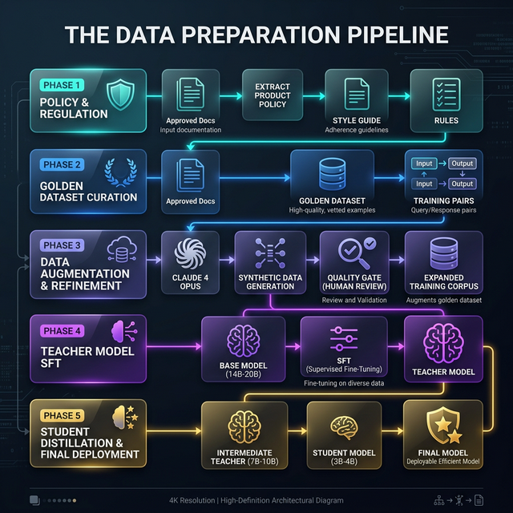


---

### SECTION 2: Multi-Tier Distillation and Student Model Optimization

**Introduction**
A single model often struggles to balance **Technical Accuracy** with **Instructional Style**. 

To solve this, we apply Linkedin's **Multi-Tier Distillation** methodology. We use two distinct "Teacher" model objectives to train our ultra efficient "Student" model. This ensures the final output is both technically sound and stylistically perfect, matching the examples from the original source materials.

### PHASE 1: Implement Multi-Tier Distillation

We separate the use case source materials and objectives into streams and use a staged distillation approach.

**1. Define the Conflicting Objectives**

- **Objective A (Technical Accuracy):** The model must correctly identify specifics that are critical to the task, and was not part of its original generalized training. The model must not hallucinate non-existent content.
- **Objective B (Instructional Style):** The model must strictly follow the visual formatting and specific phrasing from the original source materials which is critical for legal, medical, financial, and other compliance and regulatory use cases.

**2. Configure Teacher Models**

Instead of one giant training run, we split the fine-tuning supervision:

- **Teacher (The Subject Matter Expert: 14B - 20B Parameters):**
- **Intermediate Teacher Model (7B - 10B):**

**3. Train the Student Model (The Staged Distillation)**

- **Step A: The Intermediate Teacher Model (7B - 10B):**
  - First, we distill the **14B - 20B Parameter Teacher** into a **7B - 10B Intermediate Teacher Model**.

- **Step B: The Production Student (3B):**
  - Distill the 7B - 10B Intermediate Teacher model into the final **3B Student**.

- **Why this extra step?**
  - Distilling directly from 7B to 3B can result in high information loss. The 3B acts as a "bridge," smoothing the compression curve.

### PHASE 2: Inference Optimization (The "10X Efficiency" Loop)

Once the Student model is trained, it must be optimized for production generation. We apply two optimization techniques: **Hybrid Prompting**, and **Summarization**.

**1. Technique A: Context Injection (Hybrid Prompting)**

For documentation, we inject **UI Maps** as context to prevent hallucinations.

- **Data and/or UI Maps:** A structured list (JSON/YAML) of every valid Data and/or UI item images and/or text.
- **Injection:** When prompting the Student model the Data and/or UI Map is injected into the context window.
- **Benefit:** The model doesn't need to "memorize" the Data and/or UI Map in its weights; it looks it up in the context, reducing hallucination, processing and LLM latency time.

**2. Technique B: Input Summarization**

We rarely start with perfect inputs. Internal teams generally provide raw notes. We standardize these inputs before the Student model sees them.

- **The Pre-Processor:** We use an LLM model to clean raw engineering notes and/or user input taking the raw input and summarizing it into a standardized prompt.
- **Benefit:** This standardizes the prompt length and structure, ensuring the Student Model behaves predictably every time.

#### Mermaid Diagram: Phase 2 Inference Optimization

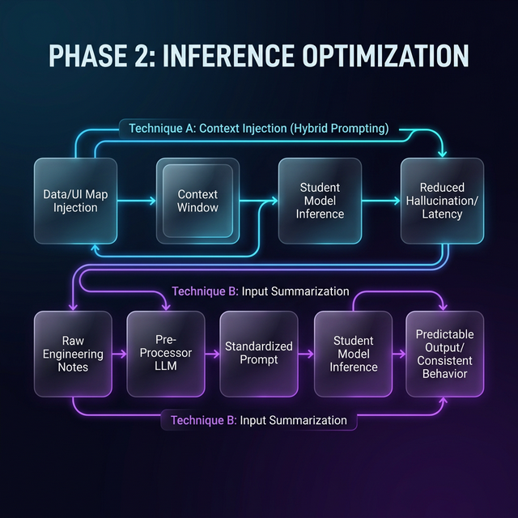


### PHASE 3: The Regression Matrix (Hill Climbing)

We ensure the model works across *all* specific use case scenarios, not just the ones in the training dataset.

**1. Create the Evaluation Matrix**

Create a spreadsheet to track the Student Model's performance across the specific domains found in the source materials:

- **Rows (Modules):** Module 1 (Account Setup), Module 3 (Data Sources), Module 9 (Data Quality).
- **Data Quality Columns (Criteria):**
  - **UI Accuracy:** 
  - **Syntax Accuracy:** 
  - **Tone:** 
  - **Formatting:** 

**2. Identify "Red" Areas**

- **Red:** The model fails the criteria.
- **Yellow:** The model passes but needs refinement.
- **Green:** The model passes perfectly.

**3. Hill Climbing Strategy**

- **Do not rollback.**
- **Targeted Fine-Tuning:** We create a small "micro-batch" of training data specifically for **Data Quality Tables** (referencing the "Available data quality rules").
- **Retrain:** Update the Student Model with this targeted data until the "Data Quality" column turns Green.

#### Mermaid Diagram: Phase 3 Regression Matrix (Hill Climbing)

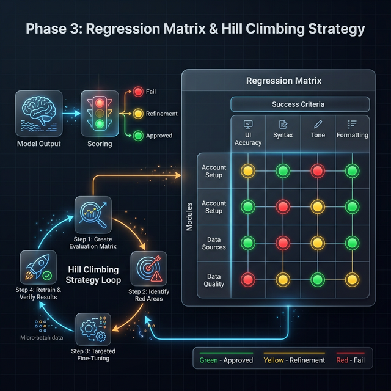


---

### SECTION 3: Human Element Scaling Strategy (HESS)

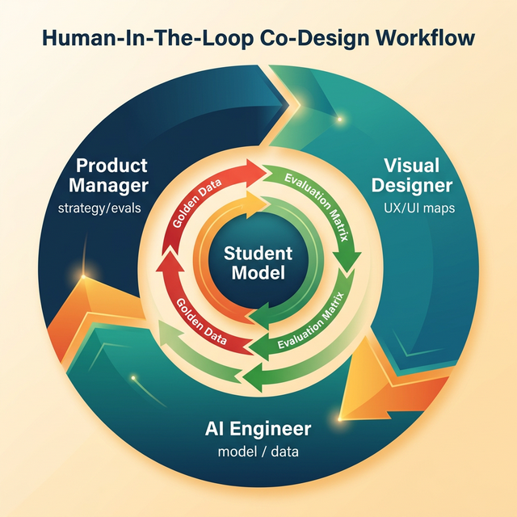

**Introduction**
Building the model is only half the battle. The LinkedIn Methodology case study revealed that success at scale required a fundamental shift in how teams operate. "You cannot treat the AI model as a black box that engineers own."

To generate materials that are indistinguishable from source materials, your internal team must adopt a **Co-Design Workflow**. The "Product Manager" (or an Automated Product Manager LLM) must become an author of technical evaluations, and the workflow must shift from "waterfall" to "iterative loops."

### PHASE 1: Restructuring the Team Roles ("PM-Driven Evals")

In traditional software development, PMs focus on strategy and UX. In the **Distillation Era**, the PM must own the **Evaluation (Eval) Process**.

**1. The New Deliverable: The "Eval" Document**

- **Old Way:** The PM or Lead Designer says, "Make the AI write 'Specific to your use case.'"
- **New Way:** The PM or Lead Designer authors a **Product Policy Eval**. This is a living document that explicitly scores the model's output.
- **Action:** Assign a "Data Steward" or "Lead Designer" to own the **Golden Dataset**. They are responsible for:
  - **Curating the Truth:** Deciding that "Specific to your use case" is the gold standard for *Data Quality* tables.
  - **Scoring the Output:** Manually reviewing the Student Model's output or drafts and marking them as "Pass" or "Fail" based *strictly* on the Product Policy.

**2. The "Bright Green Matrix"**

You must visualize quality to know when you are ready to scale.

- **Create the Matrix:** A dashboard visible to the whole team.
- **Rows:** 
- **Columns:** Success Criteria (Syntax Accuracy, Formatting Adherence, Tone Voice, Image Alignment)
- **The Rule:** You do not ship/publish until the matrix is "Bright Green" (consistently passing evals).
- **Hill Climbing:** If "Specific to your use case" is Red (failing), the Engineer does not just "tweak the prompt."
- The PM and/or Lead Designer and Engineer sit together to analyze the *Golden Data* to determine, Is the policy vague? Is the training data insufficient? If it is not we fix the data, not just the code.

### PHASE 2: The Co-Design Loop (No Handoffs)

Designers, PMs, and Engineers must work together in tight loops, not functional silos. 

**1. Synchronized Iteration**

- **Context:** Specific to your use case
- **The Loop:**
  - **Step A:** The PM and/or Visual Designer "Specific to your use case" "Create a Specific to your use case Rule Set".
  - **Step B:** The ML/AI Engineer runs the Student Model to generate the text for that step.
  - **Step C:** The PM and/or Visual Designer and the ML/AI Engineer reviews the outputs *together*. Does the text say "**Specific to your use case**"?
  - **Resolution:** Adjust the Product Policy to specify: "Always match the exact 'Specific to your use case' found in the provided source materials."

**2. Experimentation Velocity**

- **Goal:** Reduce the feedback loop from days to hours.
- **Infrastructure:** Build a simple "Playground" interface where the PM and/or Lead Designer can:
  1. Paste a raw concept (e.g., "Specific to your use case").
  2. Select the current "Student Model" version.
  3. See the generated output immediately.
  4. **Flag Errors:** Highlight text that violates the policy (e.g., missing bolding).
- **Result:** This allows the non-technical team members to "debug" the model by providing feedback that goes directly into the next fine-tuning batch.

### PHASE 3: Scaling (The Factory Model)

After successfully distilling the model "**Specific to your use case**" We generalize this infrastructure so we can apply it to *any* future "**Specific to your use case**" without rebuilding the engine.

**1. Standardize the Pipeline (The Recipe)**

Codify the steps into a repeatable "Cookbook" for your organization:

1. **Ingest:** Documents and/or Materials specific to your use case.
2. **Policy:** Write the 20-page Style Guide.
3. **Synthesize:** Use an LLM to multiply the examples.
4. **Train:** Fine-tune the Teacher.
5. **Distill:** Train the Intermediate Teacher then the Student with Multi-Tier Distillation objectives.
6. **Optimize:** Hybrid Prompting, Summarization, Inject Context Maps.

**2. Self-Service Infrastructure**

- **Objective:** Enable a new team (e.g., the "Sales Training Team") to use your engine.

**3. Resource Allocation**

- **The Bottleneck:** Realize that **Human Annotation** is the most expensive and critical part.
- **Budgeting:** Allocate budget/time specifically for experts to create the "Golden Dataset." Do not skimp here. "It almost seems overly simplistic... but human annotations are the key."

#### Mermaid Diagram: The Organizational Workflow

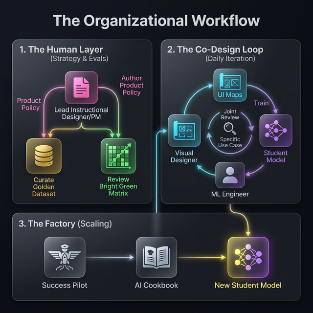


### Final Cookbook Checklist

Before we declare your project complete, we must verify:

- [ ] **Policy Defined:** Is there a written document defining "Quality" for Your Specific Use Case?
- [ ] **Golden Data:** Do we have 100-50,000 perfect examples extracted from the source materials?
- [ ] **Synthetic Scale:** Has a frontier model generated 1000+ additional examples?
- [ ] **Multi-Tier Teachers:** Are we scoring for both *Technical Accuracy* and *Style* for example?
- [ ] **Student Optimized:** Is the final model optimized according to our "Your Specific Use Case" criteria?
- [ ] **Matrix Green:** Does the model pass evals across all tested scenarios?

### Conclusion

Our **KERAUNOS: AI CUSTOM FINE-TUNING DISTILLATION METHODOLOGY** provides your team with the tools to save money, time, as well as mitigating security and compliance issues by moving away from massive, general-purpose AI models to utilizing your own specialized, custom fine-tuned **LLM Models**. By utilizing KERAUNOS, you achieve three things:

1. **Consistency:** Every output looks exactly like your use case specific source materials.
2. **Efficiency:** You can generate thousands of pages of your use case specific source materials at a tiny fraction of the cost of Frontier SOTA closed source models.
3. **Control:** You own the "Brain" (the custom fine-tuned AI/LLM models) and the "Rules" (the policy), ensuring no external API change breaks your training pipeline.

---

## 12. Key Principles

1. **The system runs the model** — Deterministic nodes enforce the pipeline; the LLM is a component, not the controller.

2. **Context over complexity** — Investing in context assembly yields better returns than sophisticated agent loops. Front-load intelligence into the prompt.

3. **Passive context for critical knowledge** — AGENTS.md ensures the agent always has language standards, security rules, and pipeline structure without needing to decide to look them up.

4. **Skills for workflows** — Package repeatable procedures as Skills with progressive disclosure. Create skills from completed workflows, not from scratch.

5. **2-round cap on fixes** — If the LLM can't fix it in 2 tries, a third won't help. Escalate to a human. This is the pragmatic engineering choice.

6. **Security is deterministic** — Dependency audits, SAST scans, and secret detection run as fixed code. The LLM cannot bypass them.

7. **Human review is load-bearing** — Every output requires human review. This is architecture, not ceremony.

---

*By Gregory Kennedy | Keraunos - A Deterministic AI Agent System | March 2026*

*My Sources: [Archix](https://arxiv.org/) Research Papers Numerous (to many to count), Stripe Dev Blog and Team Minions: Stripe’s one-shot, end-to-end coding agents: Part 1 - https://stripe.dev/blog/minions-stripes-one-shot-end-to-end-coding-agents Part 2- https://stripe.dev/blog/minions-stripes-one-shot-end-to-end-coding-agents-part-2, Linkedins Erran Berger (VP of Product Engineering) https://youtu.be/ErDS9TIQoWU?si=58DcaqFzbJvRZW9g, Anthropic Dev Blog, Vercel Dev Blog, OpenHands Dev Blog, Block Goose, +++*

Profound Gratitude to all of the OG women and men mathematicians, engineers, scientists and researchers from The 9th-century Persian mathematician Muhammad ibn Mūsā al-Khwārizmī who is widely credited as the inventor of the algorithm (The word "algorithm" is a direct, albeit slightly altered, derivative of "Al-Khwarizmi"), to Ada Lovelace (19th Century/1843): Credited with creating the first algorithm designed to be processed by a machine, and the numerous others who paved the way for me, and all of us.  Gregory 
